# 🏢 Bài tập lớn Quản Lý và Đặt Món Cơm Tấm Anh High

> **Học phần:** Phát triển ứng dụng web 2  
> **Sinh viên thực hiện:** Nguyễn Huỳnh Tường - 65134116
> **Công nghệ nền tảng:** Java Spring Boot MVC + Thymeleaf + Spring Data JPA + MySQL

---

## 🧭 Tổng Quan Giải Pháp

Hệ thống **Quản lý và Đặt Món Cơm Tấm Anh High** được xây dựng nhằm số hóa toàn bộ quy trình vận hành của một nhà hàng cơm tấm hiện đại. Ứng dụng giải quyết triệt để bài toán gọi món thủ công, tối ưu hóa luồng tương tác hai chiều giữa **Chủ quán (Admin)** và **Khách hàng đặt cơm (User)**. 

Hệ thống giúp quản lý thực đơn linh hoạt, tự động hóa quy trình kế toán lập hóa đơn, dọn dẹp giỏ hàng thông minh và minh bạch hóa lịch sử mua sắm của thực khách, giảm thiểu tối đa sai sót vận hành so với phương thức ghi sổ truyền thống.

### Kỹ Thuật Nổi Bật Trong Dự Án
* **Spring MVC Architecture:** Tổ chức mã nguồn chuẩn mực, phân tầng trách nhiệm rõ ràng giúp hệ thống dễ dàng bảo trì và mở rộng (`Controller` -> `Service` -> `Repository` -> `Model Entities`).
* **Dynamic Data Sync:** Ứng dụng sức mạnh của Hibernate/JPA Object-Relational Mapping (ORM) để đồng bộ hóa chính xác cấu trúc dữ liệu thực tế (như các trường `sdtnhan`, `diachinhan`, `dongiaban`) giữa mã nguồn Java và hệ quản trị MySQL thông qua Annotation `@Column`.
* **Data Integrity Protection:** Thiết lập các kịch bản dọn dẹp liên kết khóa ngoại chạy ngầm và cơ chế **"Xóa mềm"** (Khóa tài khoản bằng cách ép trạng thái thay vì xóa vật lý). Kỹ thuật này giúp Admin chặn quyền truy cập của thành viên vi phạm hoặc ẩn danh mục lỗi mà hoàn toàn không làm mồ côi hay sập hệ thống hóa đơn cũ (`DataIntegrityViolationException`).
* **Session-Based Authentication:** Trích xuất và đối chiếu thông tin trực tiếp từ kiến trúc `HttpSession` của hệ thống để phân định không gian làm việc độc lập, tự động ẩn/hiện các nút chức năng (như nút Giỏ hàng, nút Thêm món ăn) dựa trên vai trò phân quyền `ADMIN` và `USER`.

---

## 🛠️ Bản Đồ Chức Năng Hệ Thống (System Capabilities)

### 🟢 Phân Hệ Khách Hàng (USER Workspace)
- **Khám phá thực đơn động:** Xem danh sách đĩa cơm tấm bốc khói theo thời gian thực kèm đơn giá định dạng VNĐ chuẩn; hỗ trợ tìm kiếm theo từ khóa và lọc nhanh theo danh mục món ăn.
- **Xem chi tiết & Phản hồi:** Truy cập trang chi tiết món ăn với lời giới thiệu sinh động tự động hóa theo tên/giá món và để lại bình luận, đánh giá thực tế về chất lượng bữa ăn.
- **Quản lý giỏ hàng thông minh:** Thêm món ăn vào giỏ kèm ghi chú topping riêng biệt; hệ thống tự động cộng dồn số lượng và nhân chuỗi tính toán tổng tiền thanh toán theo thời gian thực.
- **Chốt đơn & Theo dõi lịch sử:** Điền thông tin giao nhận (Số điện thoại nhận cơm, Địa chỉ giao hàng, Ghi chú nhà bếp) để tạo hóa đơn, đồng thời truy cập trang "Đơn mua" cá nhân để giám sát trạng thái duyệt đơn từ chủ quán.

### 🔵 Phân Hệ Quản Trị Viên (ADMIN Workspace)
- **Quản trị thực đơn (Menu):** Thêm món ăn mới với biểu mẫu hỗ trợ upload tệp tin hình ảnh vật lý (`multipart/form-data`), chỉnh sửa đơn giá, tên món và quản lý danh mục thể loại món ăn.
- **Điều phối đơn hàng:** Tiếp nhận hóa đơn đặt cơm từ khách hàng đổ về theo thời gian thực trên Dashboard; thực hiện cập nhật trạng thái đơn hàng (`Chờ xác nhận` -> `Đang chuẩn bị` -> `Đang giao` -> `Đã giao`) để đồng bộ với khách hàng.
- **Kiểm duyệt an ninh:** Giám sát toàn bộ danh sách tài khoản thành viên, thực hiện đổi quyền hạn hoặc khóa/mở khóa tài khoản người dùng vi phạm nội quy một cách an toàn.

---

## 🏛️ Kiến Trúc Hệ Thống (System Architecture)

Dự án Cơm Tấm Anh High được xây dựng dựa trên kiến trúc **MVC (Model - View - Controller)** kết hợp cùng các công nghệ mạnh mẽ trong hệ sinh thái Java:

- **Tầng Giao Diện (View):** Sử dụng bộ máy dựng hình động **Thymeleaf** kết hợp cùng HTML5, CSS3 để kết xuất dữ liệu trực tiếp từ máy chủ trả về, giúp giao diện hiển thị đồng bộ, scannable và mượt mà.
- **Tầng Điều Hướng (Controller):** Các lớp `@Controller` đóng vai trò tiếp nhận các yêu cầu HTTP (HTTP Requests), điều phối luồng dữ liệu, xử lý các tiền tố định tuyến (như `@RequestMapping("/gio-hang")`) và điều hướng View.
- **Tầng Xử Lý Nghiệp Vụ (Service):** Nơi chứa toàn bộ logic lõi của hệ thống (thuật toán tích lũy giỏ hàng, kịch bản chốt đơn gom chi tiết hóa đơn, dọn dẹp bộ nhớ đệm giỏ hàng sau khi đặt thành công).
- **Tầng Truy Xuất Dữ Liệu (Repository/Model):** Ứng dụng **Spring Data JPA** để ánh xạ thực thể đối tượng và tương tác trực tiếp với cơ sở dữ liệu **MySQL**, bảo vệ toàn vẹn dữ liệu bằng các ràng buộc chặt chẽ.

---

## 📸 Giao Diện Hệ Thống (Màn Hình Triển Khai)

---

### 🌐 PHẦN I: PHÂN HỆ XÁC THỰC & CHỨC NĂNG CHUNG

#### 🔹 Hình 6.1: Giao diện trang chủ hệ thống dành cho khách vãng lai (Chưa đăng nhập)
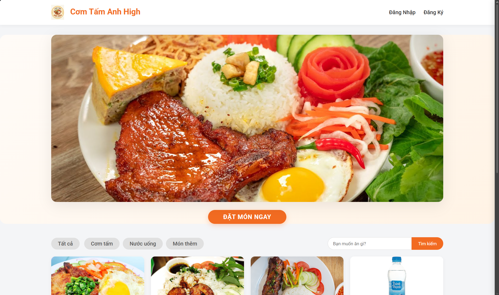

#### 🔹 Hình 6.2: Biểu mẫu đăng ký tài khoản thành viên mới dành cho thực khách
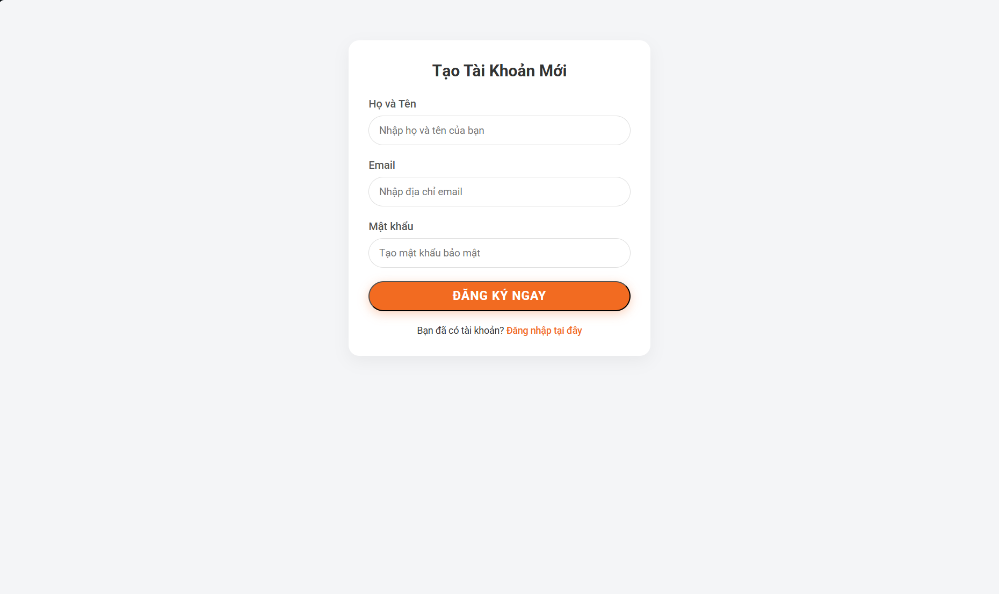

#### 🔹 Hình 6.3: Giao diện biểu mẫu đăng nhập bảo mật của hệ thống
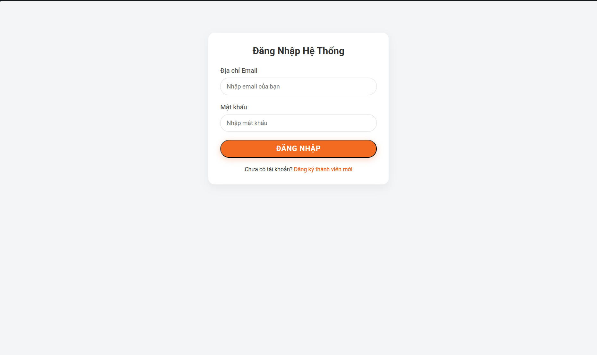

---

### 👤 PHẦN II: KHÔNG GIAN TƯƠNG TÁC CỦA KHÁCH HÀNG (USER)

#### 🔹 Hình 6.4: Giao diện trang chủ thực đơn sau khi USER đăng nhập (Hiển thị giỏ hàng và nút đặt món)
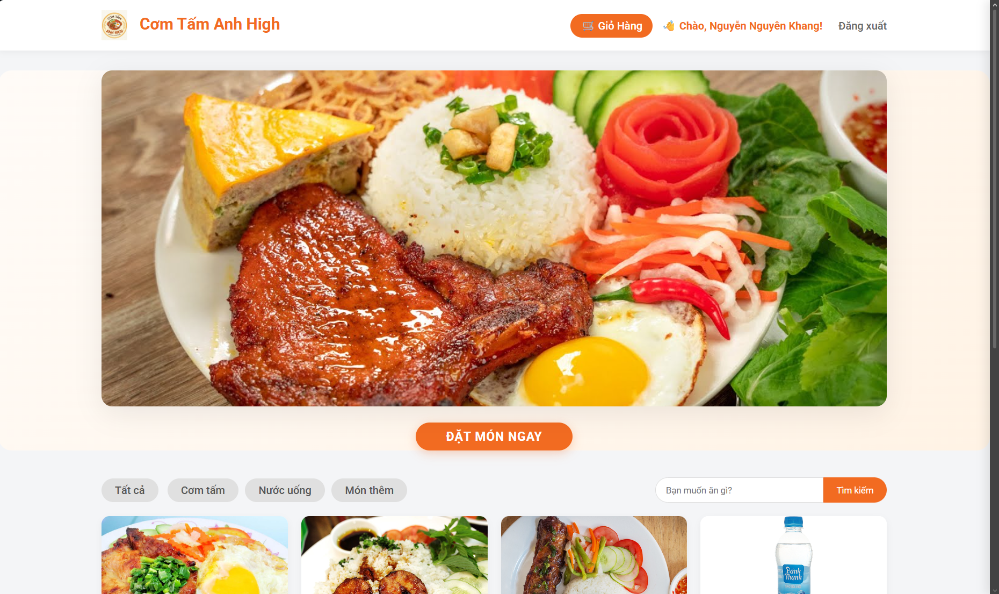

#### 🔹 Hình 6.5: Giao diện kết quả tìm kiếm và bộ lọc món ăn theo danh mục thực đơn
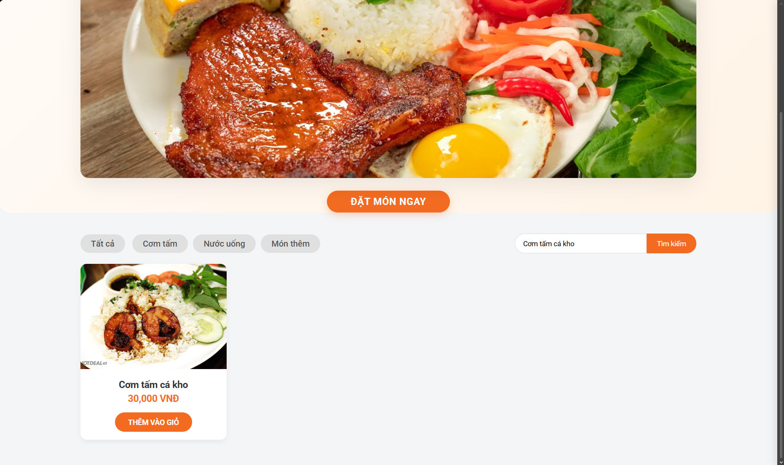

#### 🔹 Hình 6.6: Màn hình xem chi tiết món ăn tích hợp lời giới thiệu động và phân hệ Bình luận
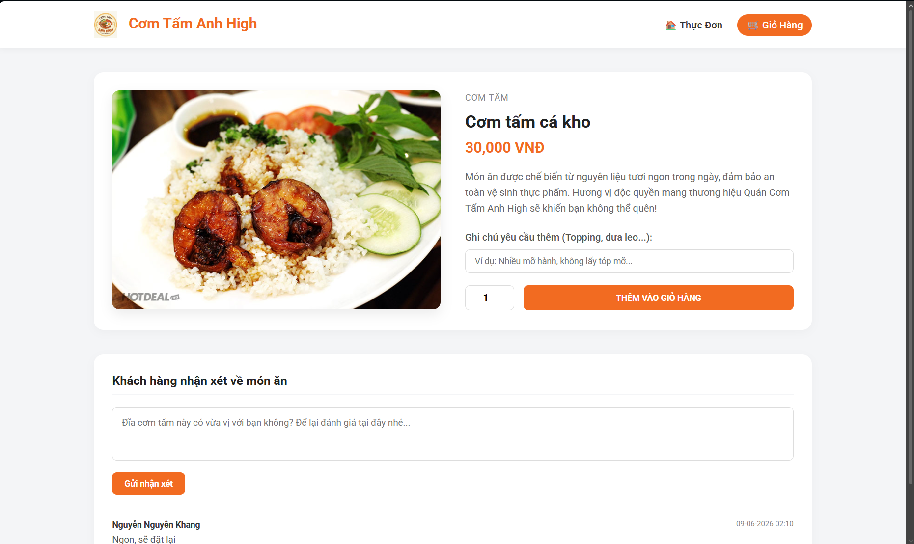

#### 🔹 Hình 6.7: Bảng kê chi tiết giỏ hàng, tự động tính tổng tiền và biểu mẫu nhập thông tin giao nhận cơm
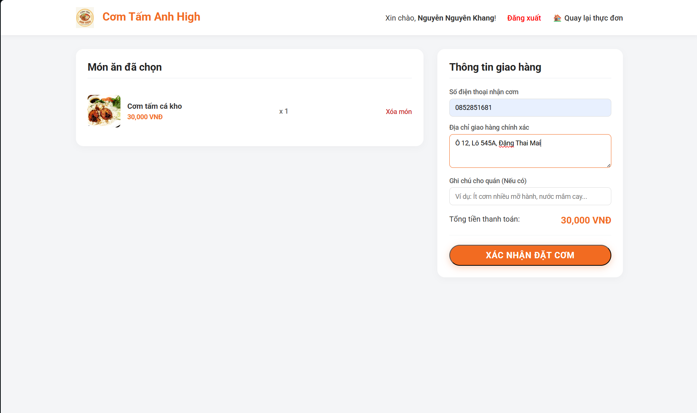

#### 🔹 Hình 6.8: Màn hình thông báo đặt món thành công
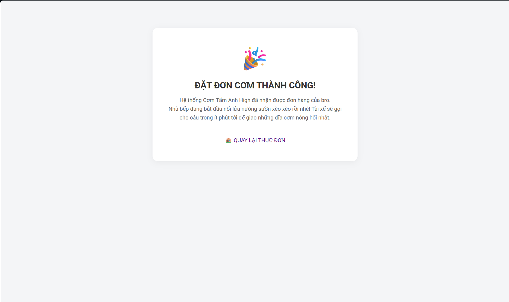

#### 🔹 Hình 6.9: Giao diện trang Lịch sử đơn hàng (Đơn mua) giúp khách theo dõi trạng thái xử lý đơn
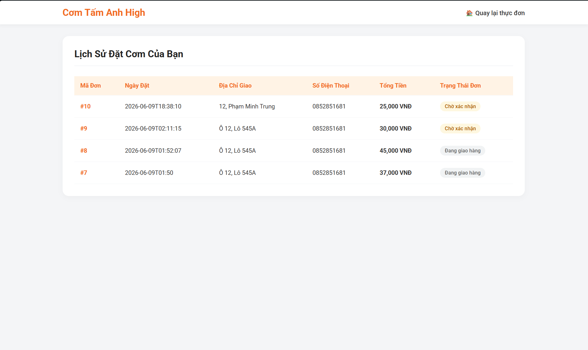

---

### 🛡️ PHẦN III: KHÔNG GIAN QUẢN TRỊ CỦA CHỦ QUÁN (ADMIN)

#### 🔹 Hình 6.10: Bảng điều khiển tổng quan (Dashboard) và Thanh điều hướng Side-bar ẩn/hiện của Admin
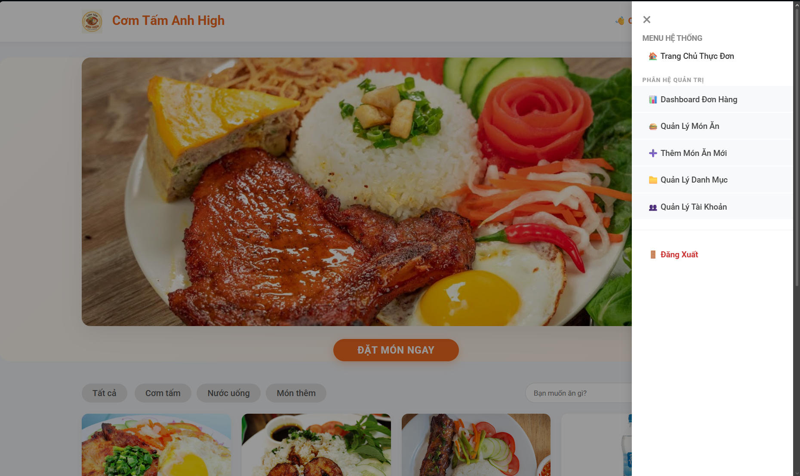

#### 🔹 Hình 6.11: Trung tâm tiếp nhận và cập nhật trạng thái các đơn đặt cơm tấm từ khách hàng
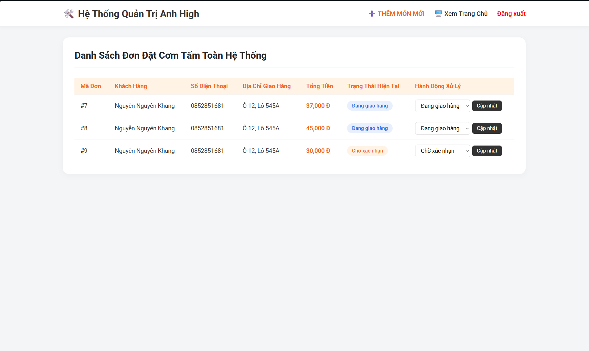

#### 🔹 Hình 6.12: Giao diện danh sách quản lý toàn bộ các món ăn có trong thực đơn nhà hàng
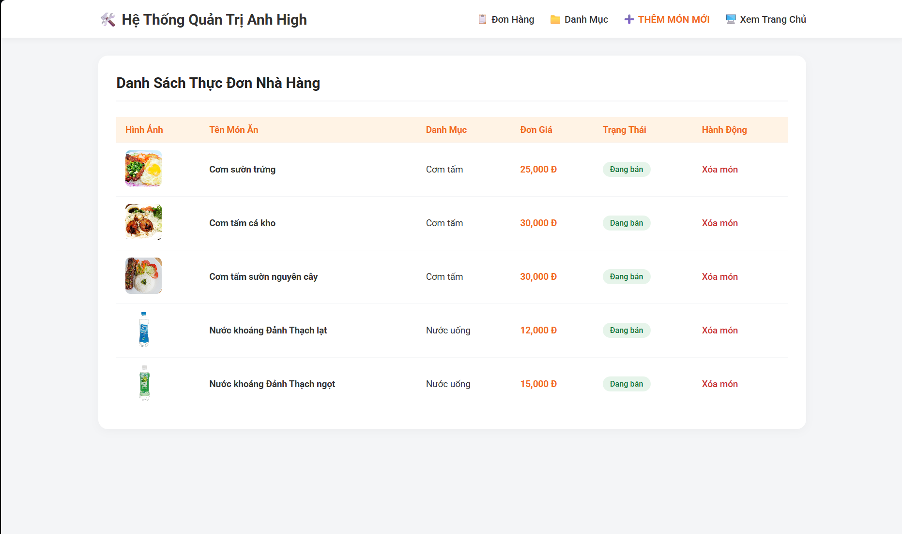

#### 🔹 Hình 6.13: Biểu mẫu thêm món ăn mới vào thực đơn có tích hợp nút chọn tải lên file ảnh vật lý
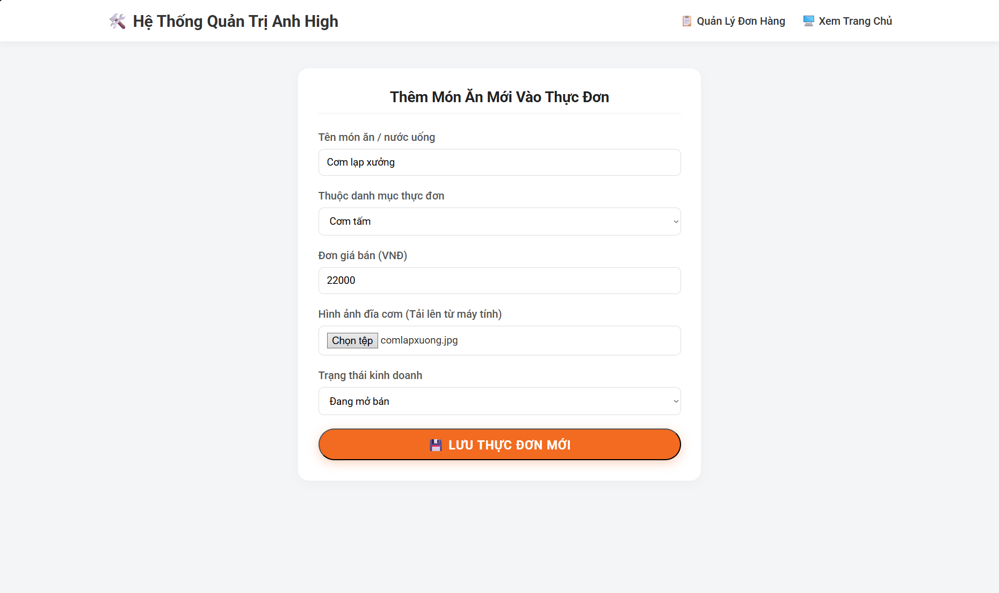

#### 🔹 Hình 6.14: Giao diện quản lý, tạo nhanh danh mục thực đơn và xóa danh mục an toàn chống lỗi khóa ngoại
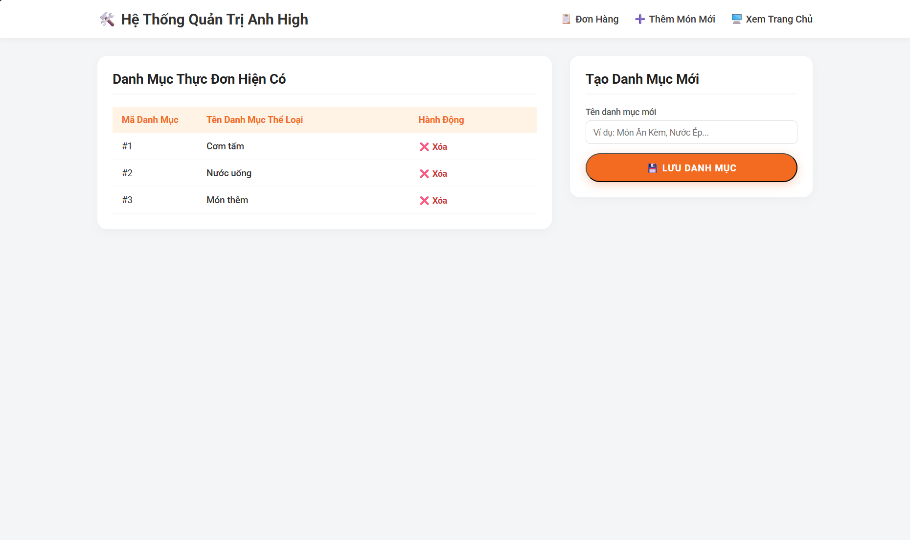

#### 🔹 Hình 6.15: Trung tâm giám sát tài khoản người dùng và thực thi chức năng khóa quyền truy cập an toàn
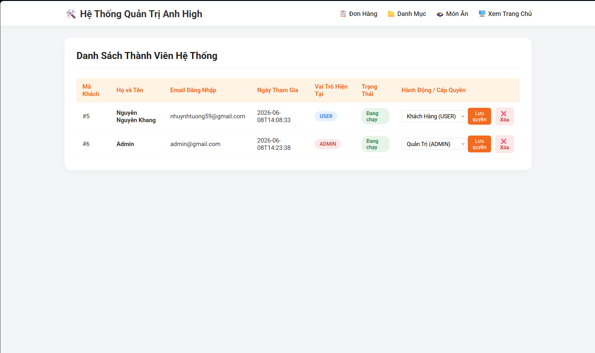

---

## 💾 Thiết Kế Lược Đồ Dữ Liệu (MySQL)

Hệ thống tổ chức lưu trữ thông tin tập trung trên RDBMS MySQL thông qua các bảng quan hệ logic đã được chuẩn hóa cấu trúc:
1. `danhmuc`: Lưu trữ các danh mục món ăn (Cơm tấm, đồ uống, món ăn kèm...).
2. `monan`: Ghi nhận dữ liệu các món ăn, đơn giá, đường dẫn hình ảnh và trạng thái kinh doanh.
3. `taikhoan`: Quản lý định danh tài khoản thành viên, mật khẩu và vai trò phân quyền (`ADMIN`/`USER`).
4. `giohang`: Bộ nhớ đệm lưu trữ tạm thời các món ăn, số lượng và ghi chú do khách chọn trước khi thanh toán.
5. `hoadon`: Lưu trữ lịch sử đơn hàng, mốc thời gian, tổng tiền, trạng thái đơn và thông tin giao nhận (`sdtnhan`, `diachinhan`).
6. `chitiethoadon`: Bảng trung gian lưu chi tiết số lượng và `dongiaban` của từng món ăn thuộc về hóa đơn đó.
7. `binhluan`: Lưu trữ các nội dung đánh giá, phản hồi của thực khách tại mỗi trang món ăn.

---

## ⚙️ Hướng Dẫn Triển Khai Hệ Thống Tại Máy Cục Bộ (Local)

### ⌨️ Chuẩn bị môi trường máy chủ
* Nền tảng Java: JDK 17+.
* Cơ sở dữ liệu: XAMPP Server (MySQL v8.0 hoặc tương đương).
* Trình biên dịch: Eclipse IDE (đã cài STS) hoặc IntelliJ IDEA.

### Bước 1: Đồng bộ hóa cơ sở dữ liệu
1. Khởi động hai dịch vụ **Apache** và **MySQL** bên trong XAMPP Control Panel.
2. Sử dụng trình duyệt truy cập vào hệ quản trị `http://localhost/phpmyadmin/`.
3. Tạo mới một cơ sở dữ liệu trống với tên chính xác là: `quanlycomtam`.
4. Chọn tab **Import**, tải file script dữ liệu `quanlycomtam.sql` đính kèm trong thư mục dự án lên để tự động thiết lập cấu trúc bảng và nạp dữ liệu mẫu.

### Bước 2: Thiết lập tham số kết nối cấu hình Spring Boot
Mở mã nguồn dự án trên IDE, tìm đến file cấu hình hệ thống `src/main/resources/application.properties` để điều chỉnh thông số truy cập MySQL của máy bạn:

```properties
spring.datasource.url=jdbc:mysql://localhost:3306/quanlycomtam?useUnicode=true&characterEncoding=UTF-8
spring.datasource.username=root
spring.datasource.password=
spring.jpa.hibernate.ddl-auto=update
spring.jpa.show-sql=true
```
***
### Bước 3: Khởi chạy ứng dụng
Tìm đến class chạy chính chứa annotation @SpringBootApplication (QuancomtamApplication.java) bên trong package để khởi động ứng dụng Server. Khi hệ thống báo chạy thành công tại cổng mạng mặc định, truy cập đường dẫn http://localhost:8080 trên trình duyệt để trải nghiệm luồng nghiệp vụ.